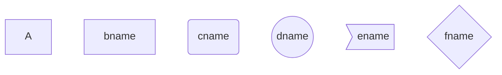

# 画图

## graph(流程图)

> 图方向
>
> - TB，从上到下
> - TD，从上到下
> - BT，从下到上
> - RL，从右到左
> - LR，从左到右

> 节点形状
>
> - 默认节点 A
> - 文本节点 B[bname]
> - 圆角节点 C(cname)
> - 圆形节点 D((dname))
> - 非对称节点 E>ename]
> - 菱形节点 F{fname}

**连线**

> 节点间的连接线有多种形状，可连接线中加入标签：
>
> - 箭头连接 A1–->B1
> - 开放连接 A2—B2
> - 标签连接 A3–text—B3
> - 箭头标签连接 A4–text–>B4
> - 虚线开放连接 A5.-B5
> - 虚线箭头连接 A6-.->B6
> - 标签虚线连接 A7-.text.-B7
> - 标签虚线箭头连接 A8-.text.->B8
> - 粗线开放连接 A9===B9
> - 粗线箭头连接 A10==>B10
> - 标签粗线开放连接 A11==text===B11
> - 标签粗线箭头连接 A12==text==>B12

## subgraph（子图）

## [sequence](https://so.csdn.net/so/search?q=sequence&spm=1001.2101.3001.7020) diagram （序列图）

