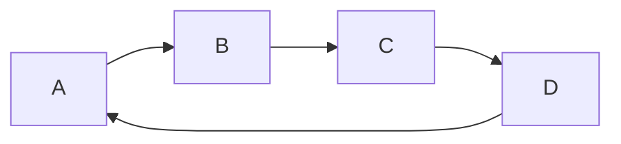
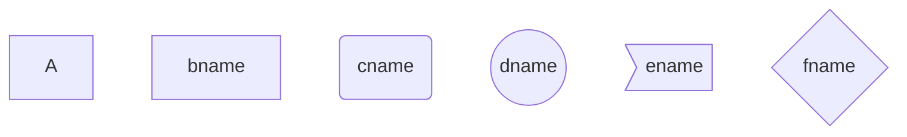
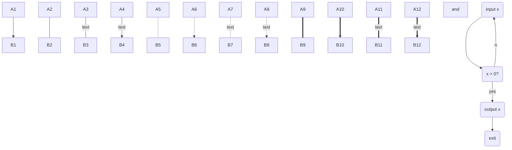
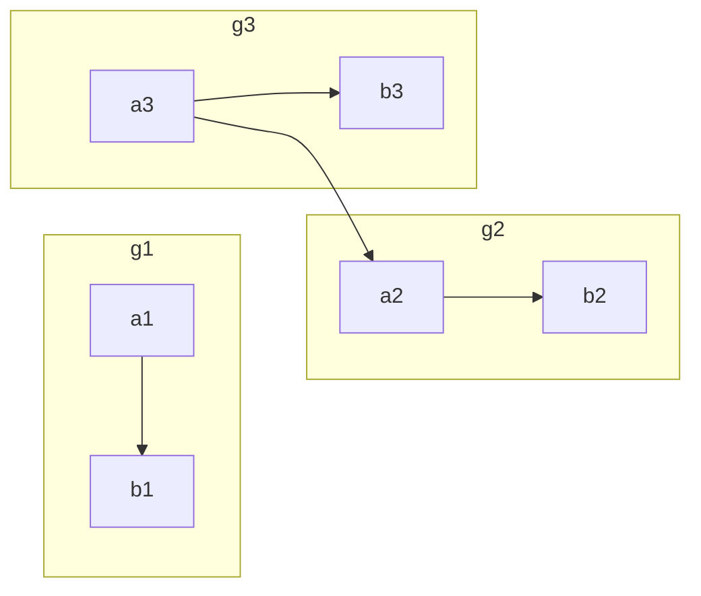
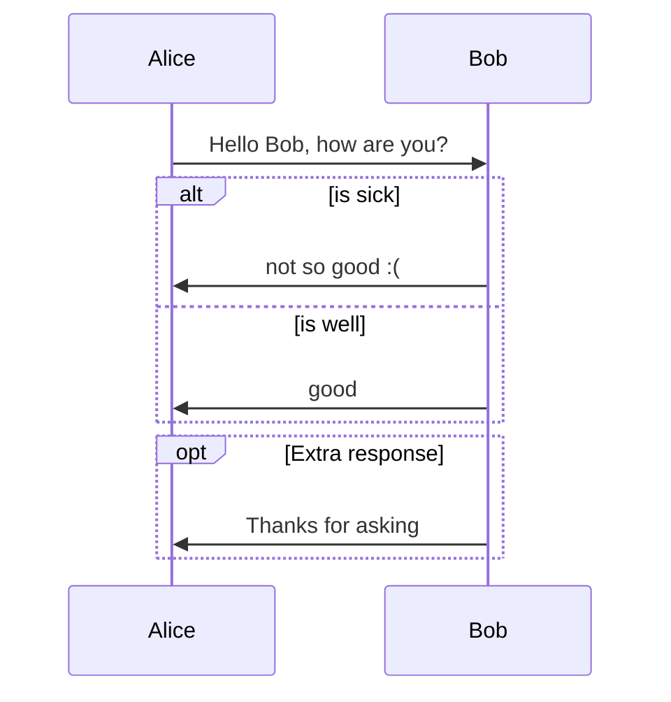
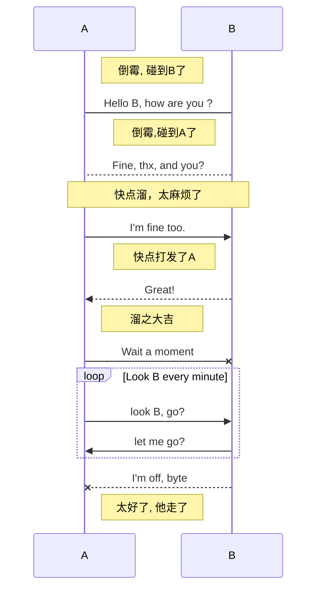
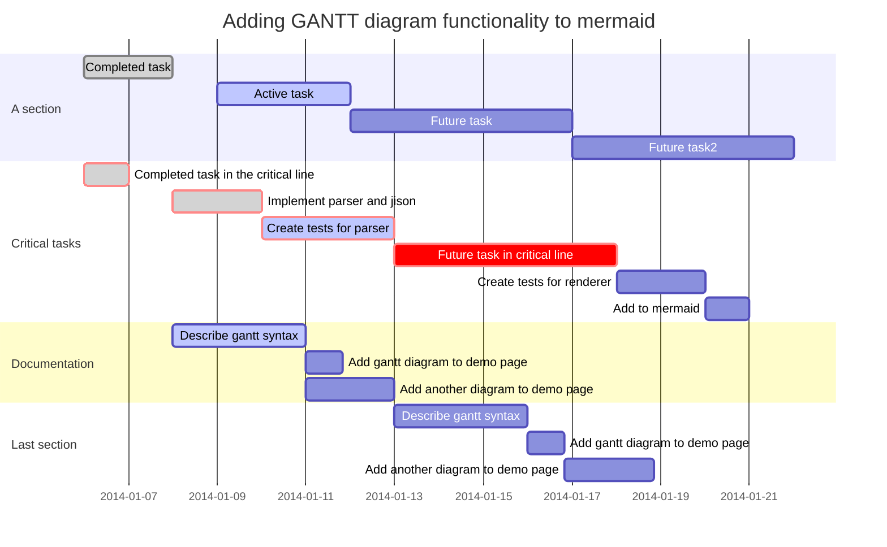

# 画图

## graph(流程图)

**图方向**

```md
graph LR;
  A-->B
  B-->C
  C-->D
  D-->A
```



**节点方向**

```md
graph TB
  A
  B[bname]
  C(cname)
  D((dname))
  E>ename]
  F{fname}
```




**连线**

```md
graph TB
  A1-->B1
  A2---B2
  A3--text---B3
  A4--text-->B4
  A5-.-B5
  A6-.->B6
  A7-.text.-B7
  A8-.text.->B8
  A9===B9
  A10==>B10
  A11==text===B11
  A12==text==>B12
  and

  start("input x") --> handler("x > 0?")
  handler --yes--> yes("output x")
  handler --no--> start
  yes --> exit("exit")
```



## subgraph（子图）

```md
graph LR
  subgraph g1
    a1-->b1
  end
  subgraph g2
    a2-->b2
  end
  subgraph g3
    a3-->b3
  end
  a3-->a2
```



## sequence diagram （序列图）

```md
sequenceDiagram
　　Alice->>Bob: Hello Bob, how are you?
　　alt is sick
　　　　Bob->>Alice:not so good :(
　　else is well
　　　　Bob->>Alice:good
　　end
　　opt Extra response
　　　　Bob->>Alice:Thanks for asking
　　end
```



```md
sequenceDiagram
  Note right of A: 倒霉, 碰到B了
  A->B:   Hello B, how are you ?
  note left of B: 倒霉,碰到A了
  B-->A:  Fine, thx, and you?
  note over A,B: 快点溜，太麻烦了
  A->>B:  I'm fine too.
  note left of B: 快点打发了A
  B-->>A: Great!
  note right of A: 溜之大吉
  A-xB:   Wait a moment
  loop Look B every minute
　  A->>B: look B, go?
　　B->>A: let me go?
　end
　B--xA: I'm off, byte 　
  note right of A: 太好了, 他走了
```




```md
gantt
    dateFormat  YYYY-MM-DD
    title Adding GANTT diagram functionality to mermaid
 
    section A section
    Completed task            :done,    des1, 2014-01-06,2014-01-08
    Active task               :active,  des2, 2014-01-09, 3d
    Future task               :         des3, after des2, 5d
    Future task2               :         des4, after des3, 5d
 
    section Critical tasks
    Completed task in the critical line :crit, done, 2014-01-06,24h
    Implement parser and jison          :crit, done, after des1, 2d
    Create tests for parser             :crit, active, 3d
    Future task in critical line        :crit, 5d
    Create tests for renderer           :2d
    Add to mermaid                      :1d
 
    section Documentation
    Describe gantt syntax               :active, a1, after des1, 3d
    Add gantt diagram to demo page      :after a1  , 20h
    Add another diagram to demo page    :doc1, after a1  , 48h
 
    section Last section
    Describe gantt syntax               :after doc1, 3d
    Add gantt diagram to demo page      : 20h
    Add another diagram to demo page    : 48h
```



